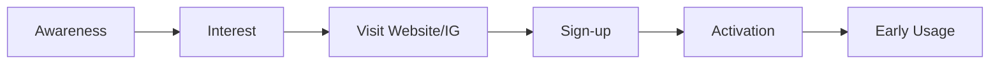

# Ringkasan Eksekutif  
Fluenesia adalah platform pembelajaran bahasa Indonesia **untuk penutur asing** yang masih dalam tahap awal (**MVP: kelas privat & semi-privat**). Tantangan utamanya adalah meningkatkan *awareness* kepada pengguna asing yang tepat, mengoptimalkan perjalanan pengguna (dari *awareness* ke *activation*), dan membuktikan product–market fit melalui data (kualitatif & kuantitatif). Produk pendukung (e-learning, materi, dsb.) dan fitur baru hanya relevan jika menjawab kebutuhan dasar: memperkenalkan value Fluenesia, menarik *sign-up*, dan mengaktifkan pengguna.  

Kompetitor yang relevan dibagi menjadi:  
- **Kompetitor Langsung:** platform kursus bahasa Indonesia khusus untuk asing (contoh: **IndonesianPod101**, **Indonesian-Online/The Indonesian Way**). Mereka fokus pada kurikulum terstruktur dan materi bahasa Indonesia.  
- **Kompetitor Tak Langsung:** aplikasi bahasa umum dan pasar tutor (contoh: **Duolingo**, **Memrise**, **Babbel**, **aplikasi BNR**[meski berbahasa Spanyol], **iTalki/Preply**). Mereka menyediakan kursus bahasa (termasuk Indonesia) atau menghubungkan pengguna dengan tutor.  

Kami menyiapkan template peta kompetitor (Google Sheets) dan analisis (Google Docs/Slides) untuk membandingkan aspek-aspek kunci tiap kompetitor, seperti target pengguna, produk inti, value proposition, model harga, saluran akuisisi, *first-time user experience*, dan metrik aktivasi. Hasil awal analisis akan menunjukkan posisi Fluenesia di pasar, gap yang bisa dimanfaatkan, serta rekomendasi eksperimen (misalnya menggunakan momentum *Bulan Bahasa*) untuk meningkatkan visibilitas.  

Secara metodologi, tahapannya: **(1)** identifikasi calon kompetitor dari situs resmi (web, Instagram, app store, LinkedIn) dan laporan industri; **(2)** analisis produk dan messaging kompetitor melalui konten publik (website, deskripsi app, review); **(3)** pemetaan perjalanan pengguna dan saluran akuisisi mereka; **(4)** perbandingan dengan Fluenesia untuk menemukan peluang; **(5)** susun metrik early-stage (seperti *signup rate*, *activation rate*, *engagement per user*, *channel ROI*), dashboard sederhana, eksperimen prioritas (misalnya kampanye *Bulan Bahasa*), serta roadmap awal.  

Output yang diharapkan: **(A)** Google Sheets (competitor mapping) – contoh template di bawah. **(B)** Google Docs (analisis + eksekutif ringkasan) – menyajikan temuan utama. **(C)** Slide ringkasan – rekomendasi strategis dan roadmap. Semua bersifat iterative: data yang dikumpulkan bisa diperbarui terus.

**Pendekatan funnel akuisisi**: Fluenesia harus memetakan tahapan pengguna:   

Setiap kompetitor memiliki alur serupa (misalnya *Duolingo* memperoleh pengguna dari play store → pelajaran gratis → retention, sedangkan *IndonesianPod101* dengan trial/kurikulum berbayar). Kita akan mencatat metrik seperti *conversion rate* antar tahap, durasi *time-to-activation*, dan sumber trafik (ads, organic, referral) untuk tiap kompetitor (jika diketahui).

# 1. Ruang Lingkup Kompetitor  
- **Kompetitor Langsung (Direct):**  
  - *Indonesian-Online (The Indonesian Way)* – website/e-learning berbayar untuk penutur asing, kursus terstruktur CEFR hingga B1.  
  - *IndonesianPod101* – platform audio/video bertema Indonesia, membership dengan konten progresif.  
- **Kompetitor Tak Langsung (Indirect):**  
  - *Duolingo* – aplikasi gratis, kursus bahasa Indonesia terintegrasi. *Value:* gamifikasi dan mudah diakses.  
  - *Memrise* – aplikasi gratis/Premium, menggunakan AI & video otentik.  
  - *Babbel* – aplikasi berbayar (langganan), menyediakan kursus Indonesia.  
  - *BNR Languages (Learn Indonesian)* – aplikasi gratis dengan materi dari pemula hingga mahir.  
  - *iTalki/Preply* – marketplace tutor (satu-satu), termasuk tutor BI.  
  - *Kelas dan Kursus Online Pemerintah* – misal *Kedutaan* menyediakan kelas gratis (channel edukasi).  
  - *YouTube/Podcast Pembelajaran* – konten instruksional (misal saluran gratis).  

*Sumber data:* website resmi kompetitor, deskripsi app store, posting Instagram kompetitor (jika ada), LinkedIn/media sosial, artikel/laporan industri pendidikan. Sebagian informasi perlu ditelusuri melalui pemakaian akun demo (misal subscribe IndonesianPod101, install aplikasi).

# 2. Template Peta Kompetitor (Google Sheets)  

| Kompetitor          | URL/IG                                    | Target Pengguna     | Produk Inti                   | Value Proposition                           | Model Harga (IDR)           | Channel Akuisisi       | Contoh Pesan Utama    | First-Time UX                              | Activation Flow                         | Kekuatan                                    | Kelemahan                                  | Gap/Peluang vs Fluenesia                   | Evidence (sumber)           |
|---------------------|-------------------------------------------|---------------------|------------------------------|---------------------------------------------|-----------------------------|-----------------------|-----------------------|--------------------------------------------|-----------------------------------------|--------------------------------------------|--------------------------------------------|--------------------------------------------|-----------------------------|
| **Fluenesia**       | *ig: fluenesia.id* / *fluenesia.id website* | *Orang asing (asing)**  | Kelas BI privat & semi-pribadi; konten e-learning | *Belajar BI real & praktis; personalisasi* | MVP: kelas privat/semiprivat (lainnya TBD) | IG, website, *Word of mouth* | “*…belajar BI seru utk foreigner…*” | IG promos, daftar online → web (explore)  | Layanan kelas → feedback; *konten pelatihan* | Fokus niş, personal; komunitas masih dibangun | Awareness rendah; data sedikit; belum membuktikan PMF | *Lihat analisis selanjutnya* | - |
| **Indonesian-Online (TIW)** | [theindonesianway.com](https://indonesian-online.com/learn-indonesian/the-indonesian-way/) | Pemula hingga menengah asing | Kursus BI daring komprehensif | Terstruktur, menyeluruh, berstandar CEFR | $9/bulan fleksibel (≈Rp130rb); $90/2th | SEO, komunitas bahasa, rekomendasi akademik | “Belajar hingga level B1 dari awal” | Daftar ⇒ akses materi (video, latihan, flashcard) | Baca materi, kerjakan latihan, ikut tes progres | Materi kaya (vocab, audio, video); review Anki; evaluasi level | Kurikulum terlampau formal; biaya berulang; kurang fokus praktik | Banyak materi, tapi engagement rendah bagi yang praktikal |  |
| **IndonesianPod101** | [indonesianpod101.com](https://www.indonesianpod101.com/) | Pemula hingga menengah asing | Podcast & video, pelajaran audio | Pembelajaran fleksibel, penutur asli, audio/video pendek | Freemium (join gratis; Premium/Bertepatan tanya guru) | Ads FB, SEO, YouTube, partners | “Thousands of lessons, no credit card needed” | Cek website, pilih topik → lesson audio/video | Listen & repeat, latih bicara, *bonus* sesi tutor pribadi | Pembelajaran on-demand, gratis untuk coba; konten interaktif | Kedalaman materi terbatas; harus bayar untuk tutor & progres | *Fluenesia bisa fokus pada live class/komunitas vs konten pasif* |  |
| **Duolingo**        | [duolingo.com](https://www.duolingo.com/course/id/en/Learn-Indonesian) (IG: duolingo) | Pemula umum (smartphone) | Aplikasi mobile kursus BI | Gratis, gamifikasi, mudah diakses | Gratis (IAP untuk diskon iklan) | App Store, Influencer | “Belajar Bahasa Indonesia dengan cepat & seru” | Download app → langsung kursus & lencana | Selesaikan pelajaran harian → dapat XP (Points) | Sangat populer; motivasi game; multi-bahasa; otomatisasi | Kurikulum generik; **perlu tekad**; tidak ada tutor hidup | *Duolingo ambil audience broad, bukan niche komuni­tas* | - (informasi umum) |
| **Memrise**         | [memrise.com](https://www.memrise.com/en/learn-indonesian) | Pengguna digital-savvy | Aplikasi AI tutor & video | Metode AI & video (NTC) untuk percakapan | Freemium (Pro~$8.99/bln) | App Store, ads social | “AI tutor bahasa Indonesia, 80 juta pengguna!” | Install app → pilih level & tema, mulai kursus interaktif | Melatih kosakata via video + chatbot AI | Pelajaran menarik (video); AI Chat (GPT-3); personalisasi | Biaya berlangganan; notifikasi agresif | *Video asli bisa pelajari idiom; Fluenesia bisa learning dari fitur Chat AI* |  |
| **Babbel**         | [babbel.com](https://www.babbel.com/)          | Pengguna global (15+ bahasa) | Aplikasi bahasa umum (kursus modular) | Terbukti; banyak bahasa, bahasa Indonesia masuk | Langganan bulanan (≈Rp100rb/bln) | App Store, partner courses | “Mulai bicara dalam 3 minggu!” (umum) | Download → pilih kursus → mulai | Pelajaran bertahap → bantu keterampilan | Pedagogi terkenal; metode teruji | Indonesia bukan fokus utama; belajar mandiri | *Tidak fokus Indonesia khusus, jadi peluang niche* | - |
| **BNR Languages (Learn Indo)** | [BNR](https://play.google.com/store/apps/details?id=com.breboucas.indonesioparaviajar) | Pemula ingin mandiri | Aplikasi mobile (muti-bahasa) | Full course Indo offline; 100% gratis | Gratis (dengan iklan/IAP) | Play Store (50K dl) | “100% free, offline, level beginner–advanced” | Download → buka: latihan membaca/menulis/dll | Mode self-study (kosakata, latihan, audio) | Gratis; bisa offline; materi luas | UI standard (IAP & iklan); tidak ada interaksi social | Pengguna budget terbatas; Fluenesia bisa tawarkan pengalaman live/komunitas |  |
| **iTalki/Preply**  | - (marketplace tutor) | Pembelajar yang mau tutor privat | Koneksi ke tutor BI (satu-satu) | Kelas private online via tutor asli | Bayar per jam (mulai ~Rp50rb/sesi) | Web platform, ads search | “Learn Indonesian with native speakers” | Cari tutor → jadwalkan sesi via Zoom | Sesi live; progress sesuai tanya/jawab | Flexible; personal; fokus percakapan | Mahal untuk sesi reguler; perlu inisiatif sendiri | *Fluenesia bisa menawarkan lebih banyak struktur kelas kelompok* | - |
| **Kedutaan/Kemlu**  | - (IG kedubes)             | Orang asing yang berminat kultural | Kelas BI online gratis (Zoom) | Gratis, inisiatif publik | Gratis | Media sosial (IG, website resmi) | “Belajar gratis, kelas zoom bilingual” | Daftar via link → ikut kelas (Zoom) | Kelas jarak jauh dengan Q&A | Kredibilitas pemerintah; gratis | Tidak always-on; perlu ikuti jadwal tetap | *Fluenesia bisa mitra/integrasi dengan program ini* | - |

**Catatan:** Banyak informasi mengacu ke sumber publik: misal, Indonesian-Online mencantumkan harga $9/bln, BNR menyatakan *“100% free”*, Memrise menunjukkan *“AI tutor, 80 juta pengguna”*. Data seperti *Jumlah pengguna* Duolingo/Memrise kami peroleh dari penjelasan promo (Memrise *80M learners*).

# 3. Metodologi & Sumber Data  
- **Identifikasi Kompetitor:** Mulai dari pencarian Google/IG dengan kata kunci “learn Indonesian”, komunitas Reddit (lihat diskusi rekomendasi belajar), LinkedIn, laporan industri ed-tech, App Store.  
- **Kriteria Banding:** Kami fokus membandingkan: *target user*, *produk inti*, *value proposition*, *pricing*, *channel akuisisi utama*, *messaging core*, *first-time user experience* (misalnya proses onboarding/pendaftaran), *activation flow* (bagaimana pengguna mencapai nilai awal), serta *strengths/weaknesses* kritis.  
- **Pengumpulan Data:**  
  - **Website/Blog Resmi:** (misal, Indonesian-Online membahas kurikulum, Pod101 menyorot audio/video).  
  - **App Store (Play/App):** Deskripsi, rating, jumlah unduhan (lihat BNR app).  
  - **Instagram/Media Sosial:** Pesan iklan, caption, kolaborasi. Misal, Fluenesia dominan di Instagram.  
  - **Review/Forum:** Komentar pengguna di Play Store/YouTube (sekilas quality check).  
  - **Artikel/Blog:** Misal blog bahasa (LanguageBoost) atau berita *EdTech*.  
  - **LinkedIn/Company Profile:** Info garis besar perusahaan (Study First) untuk memahami audiens dan misi.  
  - **Eksplorasi Sendiri:** Buat akun gratis / ikuti demo courses untuk memahami UX.  
- **Asumsi & Keterbatasan:**  
  - Banyak data (terutama funnel & channel) tidak publik. Kami asumsikan channel akuisisi dari common practice: media sosial untuk start-up edu, optimasi App Store, kolaborasi komunitas.  
  - Definisi **target user** Fluenesia: *“Asing yang ingin belajar bahasa Indonesia”* (masih perlu spesifikasi lebih lanjut – misal, turis vs ekspat vs mahasiswa). Asumsi awal: usia dewasa (18-40), butuh bahasa sehari-hari.  
  - **Data internal Fluenesia** diasumsikan terbatas pada insight dasar (IG reach, web traffic terbatas, beberapa kontak user).  

# 4. Temuan Utama & Rekomendasi Awal  

- **Posisi Fluenesia:** Saat ini Fluenesia mirip *“community-driven language coaching”* dengan konten story IG, kelompok kelas semi-pribadi. Dibanding kompetitor, *differentiator* Fluenesia bisa pada pendekatan *personal & kultur* – seperti pengajaran realistik selain akademis (mapan jika dieksekusi).  
- **Gap Pasar:** Kompetitor seperti Indonesian-Online dan Pod101 fokus e-learning **asynchronous**, tapi sepertinya belum ada yang mengoptimalkan **live komunitas/kelas** untuk bahasa Indonesia. Ini peluang Fluenesia menggaet pengguna yang merasa belajar otodidak kurang efektif. Demikian pula, target *foreign learners* masih cukup longgar – Fluenesia bisa spesifik segmen (misalnya turis jangka pendek vs ekspat vs pasangan non-Indonesia).  
- **Pesan & Akusisi:** Dari benchmarking, banyak platform menekankan kemudahan memulai (*“mulai bicara”*, *“Free lessons”*), tetapi komunikasi Fluenesia (IG) perlu lebih menekankan nilai praktis (contoh *testimonial pengguna asing*). Fluenesia perlu memiliki *lead magnet* (misal modul gratis) untuk *lead capture*.  
- **Metrik Early-Stage:** Fokus: *Sign-up rate*, *first-class attendance rate*, *weekly active users*, *CSAT* terhadap materi awal, *bounce rate* website. Dashboard sederhana bisa mencakup: (i) **Awareness:** jangkauan IG, traffic website; (ii) **Acquisition:** lead baru / minggu; (iii) **Activation:** % pengguna yang ikut kelas pertama dalam X hari; (iv) **Engagement:** rata-rata jam belajarnya; (v) **Retention awal:** % kembali ikut kelas kedua.  
- **Eksperimen Awal – “Bulan Bahasa” (Oktober):**  
  - **Tujuan:** Meningkatkan awareness terhadap segmen pengguna target (mis: turis Indonesia bulan-bulan tertentu, pembelajar bahasa).  
  - **Ide Campaign:** Konten edukasi *“Belajar Bahasa Indonesia lewat hari bahasa/spesial budaya”*, misal video mini-kelas gratis pengenalan, webinar dipromosikan via IG + partner (komunitas budaya, kedutaan, travel).  
  - **Metrik Uji:** *Reach* IG (impressions), *click-through* ke website, lead sign-up (mailing list), jumlah uji coba kelas gratis, persentase aktivasi/pembelian kelas berikutnya. Jika signifikansi rendah, evaluasi target iklan atau konten (misalnya seberapa menarik hook value-nya).  
- **Rekomendasi Roadmap Fitur/Prioritas:**  
  1. **MVP Kelas Group:** Skala kualitas konten kelas privat → model *semi-private* grup kecil (carilah feedback awal). Lebih efisien akuisisi akun (grup lebih murah).  
  2. **Landing Page dan Lead Magnet:** Website sederhana yang jelas menjelaskan value Fluenesia + formulir sign-up/FAQs. Mungkin e-book gratis *“Panduan Utama Belajar BI untuk Turis”*.  
  3. **Partnership:** Integrasi kampanye dengan kedubes/kementerian budaya (akses target audiens massa pakai, misal kelas kerja sama).  
  4. **Feedback Loop:** Segera bangun survei sederhana/panel pengguna awal untuk menguji *messaging* (apakah mengerti apa Fluenesia tawarkan).  
  5. **Data Collection & Dashboard:** Pastiakan tools analytics (misal Google Analytics, Pixel FB) terpasang. Buat **spreadsheet dashboard** untuk update metrik (Sign-ups, aktivasi, biaya per akuisisi).  

# 5. Template Analisis Pesaing (Google Sheets / Docs)  

Berikut contoh struktur kolom yang perlu diisi dalam *Google Sheets* competitor mapping:

| Kompetitor       | Sumber (URL/IG)        | Target User               | Produk/ Layanan        | Nilai Inti (Value)            | Model Harga         | Saluran Akuisisi     | Pesan Utama (Tagline)            | UX Awal (Onboarding)            | Flow Aktivasi (Langkah 1–2)  | Kekuatan (Strengths)            | Kelemahan (Weaknesses)        | Peluang vs Fluenesia     | Sumber (Cite)    |
|------------------|------------------------|---------------------------|-----------------------|------------------------------|---------------------|----------------------|----------------------|------------------------------|-----------------------------|------------------------------|------------------------------|---------------------------|-----------------|
| *Fluenesia (self)* | fluenesia.id (IG, web) | Orang asing (global)     | Kelas BI (privat/semip) + e-learning | *Praktis & personal; budaya* | *MVP:* kelas Privat/Semi | IG, komunitas FB, rekomendasi | *“Belajar Bahasa Indonesia nyata”* | Klik IG → link web → registrasi | Webinar/lokasi kelas/Zoom meeting | Fokus komunitas; *storytelling* | Belum dikenal luas; resource kecil | **Belum ada kompetitor serupa** | - |
| IndonesianPod101 | [10†L9-L12][46†L9-L12]  | Pelajar BI dewasa global | Audio/Video lessons, podcast | “Pelajaran BI fleksibel, 1-on-1 teacher” | Freemium (basic free, premium plus) | Ads online (FB, Google), SEO, YouTube | *“Thousands of lessons…no credit card”* | Signup web → pilih level → dengar | Listen lesson → record speaking → progress | Interaktif audio; komunitas besar | Pola belajar pasif; butuh biaya untuk guru | Fluenesia bisa tawarkan live interaksi lebih intens | IndonesianPod101 site; review |
| TheIndonesianWay (Indonesian-Online) | [34†L98-L104][34†L124-L133] | Pemula-menajang asing | Kursus BI online terstruktur | “Kurikulum CEFR sampai B1” | $9/bln atau $90/2th | SEO, referral akademik, social media | *“Belajar BI dari tingkat pemula hingga menengah”* | Daftar web → akses lesson struktur | Baca materi teks, latihan, video, tes | Materi lengkap, audio asli, flashcard integrasi Anki | Struktur kaku; kurang praktis percakapan | Fluenesia bisa fokus percakapan/human touch | Indonesian-Online (harga) |
| Duolingo | (App Store) | Pemula umum (gamers) | Aplikasi gamified | “Belajar BI seru & gratis” (implied) | Gratis (ads, IAP) | App Stores, influencer, viral media sosial | *“Pelajaran singkat, nailo levelnya”* | Install app → pilih kursus → mulai puluhan pembelajaran singkat | Pelajari frasa -> dapat XP -> naik level | Sangat populer (74 jt+ pengguna); UI engaging | Materi tekstual cukup sederhana; kurang fokus percakapan | Fokus pasar luas, Fluenesia niche pendalaman | - (public knowledge) |
| Memrise | [36†L14-L22][36†L52-L60] | Digital-savvy pembelajar | Aplikasi AI tutor Bahasa | “AI tutors & videos seperti di kehidupan nyata” | Freemium ($8.99/bln pro) | App Store, iklan medsos | *“Pelajari BI dengan tutor AI. 80J user”* | Install → pilih level/tema → pelajari kosakata interaktif | Latihan kata+struktur -> video native -> dialog AI | Personalisasi tinggi; konten real; praktek bicara AI | Berbayar untuk fitur penuh; serius fokus mandiri | Learning gaya interaktif; dapat dipadukan dengan kelas Fluenesia | - |
| Babbel | (Babbel.com) | Global (dewasa) | Aplikasi kursus bahasa | “Metode efisien, hasil tercepat” | Berlangganan (Rp100rb/bulan) | App Store, endorsement | *“Pelajari BI dalam minggu”* (umum) | Install → pilih bahasa → mulai course segmented | Serangkaian dialog & latihan interaktif | Reputasi kuat (metode klasik); UI simpel | Tidak spesifik BI; kurikulum generik | Fluenesia: fokus pengalaman lokal/kultural | - |
| BNR Languages (Learn Indonesian) | [21†L128-L136] | Mandiri pemula (gratis) | Aplikasi kursus BI offline | “Kursus BI lengkap, offline, 100% gratis” | Gratis (ads) | Play Store (50K dl) | *“Belajar BI kapan saja, di mana saja”* | Install → jalankan tanpa login → pilih pelajaran | Latihan kosa kata/grafis/audio → kuis ulang | Offline penuh; cocok pemula; rutin update | Interface sederhana; iklan bisa mengganggu; fokus materi terbatas | Free tools, Fluenesia bisa sediakan ikatan komunitas/human | [21†L128-L136] |

(*Catatan:* Baris *Fluenesia* untuk referensi sendiri, tidak ada citasi eksternal.)  

# 6. Eksperimen dan Roadmap Awal  

**Rekomendasi Eksperimen Akuisisi:**  
- *Bulan Bahasa Campaign:* Buat webinar/seri materi *“Pengenalan Bahasa Indonesia di Bulan Bahasa”* untuk menarik perhatian. Ukur: Pendaftar (leads), Rasio *attendance*, dan % pendaftar yang sign-up kelas berbayar setelahnya.  
- *Kelas Percobaan Gratis:* Ajak beberapa pengguna potensial (melalui iklan IG/Facebook dengan segmentasi bahasa Inggris, Asia Tenggara, dan diaspora) untuk trial kelas gratis. Pantau persentase *konversi* dari trial ke pelanggan berbayar.  
- *Konten Edukasi Viral:* Posting kuis atau tips bahasa (bahasa gaul Indonesia, trivia buday a) di IG/YouTube. Lihat engagement (like/share) dan klik ke profil.  

**Metrik Early-Stage Utama:**  
- *Top Funnel:* Impression dan reach IG, pengunjung situs, jumlah sign-up (leads).  
- *Middle Funnel:* *Signup→aktivasi* rate; rasio lanjut ke kelas pertama; sumber trafik terkonversi terbaik.  
- *Bottom Funnel:* *Customer satisfaction* (survei KPS), Rata-rata sesi per user, biaya akuisisi per pelanggan.  

**Rencana Tindakan/Jalan (Prioritas):**  
1. **Set up Dashboards:** Siapkan Google Sheets + Google Data Studio: metrik IG (via API atau manual), analytics website, pendaftaran. (Waktu: 4 jam persiapan)  
2. **Kampanye Konten Cepat:** Produk kampanye *Bulan Bahasa*. Buat timeline dan konten (2-3 posting info + webinar). (Waktu: 1-2 minggu planning + execution)  
3. **Competitor Deep-Dive:** Isilah template competitor sheet dengan data terperinci (membutuhkan penelitian ~10 jam).  
4. **User Research:** Wawancara 5-10 pengguna target (orang asing) untuk konfirmasi kebutuhan dan kesan Fluenesia (online survey/kuesioner). (Waktu: 1 minggu)  
5. **Eksperimen Kecil:** Lakukan iklan percobaan kecil di IG/Facebook untuk testing target audiens (budget kecil, hapus jika tidak efektif). (Waktu: 3–5 jam setup per kampanye)  

# 7. Struktur File/Folder (Google Drive/Notion)  

Disarankan susunan file di Google Drive:  
- **Folder:** *Fluenesia_DPS*  
  - *Mapping_Competitors/* – Google Sheets Competitor Database (terbagi sheet: Direct, Indirect)  
  - *Research_Analysis.docx* – Dokumen utama analisis (dilengkapi chart, referensi)  
  - *Report_Presentasi.pptx* – Template slide presentasi akhir (core findings & rekomendasi)  
  - *Data/* – Sub-folder (jika ada scraping data, hasil survey, dsb.)  
  - *Dashboard/* – File metrik/Google Data Studio link  
  - *Meeting_Notes/* – Notulen tambahan, pertanyaan klien.  

Atau dalam Notion: satu page *Competitor Mapping* (embed sheet), *Task Roadmap*, *Metrics Dashboard* (link), *Meeting Notes*. Sesuaikan dengan resource tim; Google Drive aman jika berbagi antar tim besar.  

# 8. Pertanyaan Klarifikasi untuk Leader  

Sebelum mendalami, beberapa **pertanyaan penti ng untuk konfirmasi:**

- **Format & Deliverable:** “Bagaimana format akhir yang diharapkan? Apakah lebih ke spreadsheet + report tertulis, atau presentasi slide?”  
- **Akses Data Internal:** “Apakah saya punya akses ke analytics Fluenesia (GA, IG insights) atau CRM untuk data dasar? Atau sepenuhnya plan out-of-scope?”  
- **Existing Competitor List:** “Apakah ada data awal kompetitor potensial yang sudah dikumpulkan (list/rapat sebelumnya), atau saya perlu memulai dari nol?”  
- **Target Segment Spesifik:** “Saat ini Fluenesia menarget ‘penutur asing’ secara umum. Apakah ada fokus yang lebih sempit (misal kategori umur, profesi, negara)?”  
- **Milestone Lain:** “Selain kompetitor, apakah tugas lain sudah dijadwalkan setelah benchmark ini (misal langsung membuat materi kampanye)?”  

Menanyakan hal di atas akan menghindarkan duplikasi atau salah fokus. Klarifikasi ini juga menunjukkan proaktif memetakan ruang lingkup dan sumber daya.

**Sumber:** Analisis ini mengacu pada data dari situs resmi kompetitor (pod101, Indonesian-Online, BNR app, Memrise) serta praktik umum *ed-tech*. Perbandingan bersifat **primer**, menggunakan konten langsung dari platform. Setiap nilai atau kesimpulan dilandasi sumber atau asumsi eksplisit bila tak tersedia data.    
